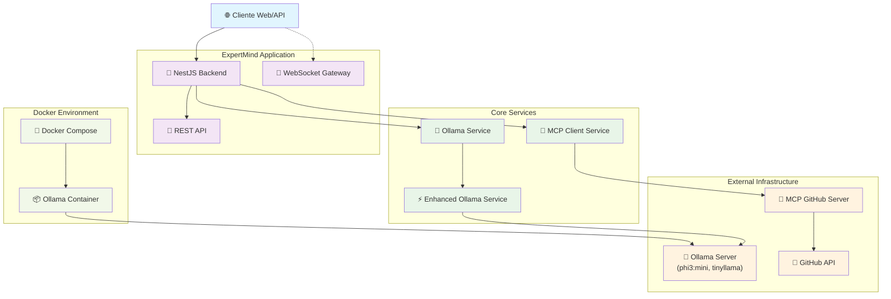
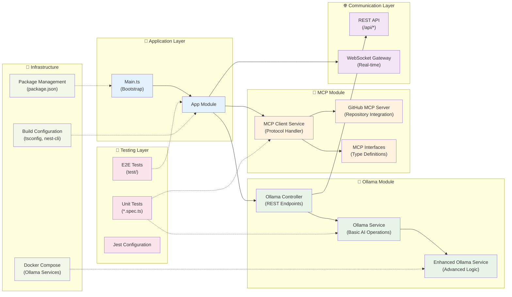

# 🧠 ExpertMind

**Sistema de Inteligencia Artificial para Análisis de Negocio y Toma de Decisiones**

ExpertMind es un sistema de inteligencia artificial diseñado para responder preguntas de negocio complejas y ofrecer análisis sobre el impacto de ciertas acciones, basándose en una base de conocimiento construida a partir de documentación y código fuente. El sistema utiliza modelos de IA locales (Ollama) integrados con repositorios de GitHub mediante el protocolo MCP (Model Context Protocol).

## 🎯 Objetivos del Proyecto

- **Análisis Inteligente**: Procesar y analizar documentación técnica y de negocio para generar insights accionables
- **Consultas Contextuales**: Responder preguntas específicas sobre proyectos, código y procesos de negocio
- **Evaluación de Impacto**: Proporcionar análisis sobre las consecuencias potenciales de decisiones y cambios
- **Integración Seamless**: Conectar con sistemas de gestión de contenido y repositorios de código
- **IA Local**: Utilizar modelos de IA ejecutados localmente para mayor privacidad y control

## 🏗️ Arquitectura

### Diagrama de Arquitectura del Sistema



### Diagrama de Componentes



### Stack Tecnológico

- **Backend**: NestJS con TypeScript
- **IA Local**: Ollama (phi3:mini, tinyllama)
- **Protocolo**: MCP (Model Context Protocol)
- **Integración**: GitHub API
- **Containerización**: Docker & Docker Compose
- **Testing**: Jest
- **WebSockets**: Para comunicación en tiempo real

### Estructura del Proyecto

```
expertmind/
├── src/
│   ├── mcp/                    # Módulo MCP para GitHub
│   │   ├── github-mcp-server.ts
│   │   ├── mcp-client.service.ts
│   │   └── interfaces/
│   ├── ollama/                 # Módulo Ollama para IA
│   │   ├── ollama.service.ts
│   │   ├── enhanced-ollama.service.ts
│   │   └── ollama.controller.ts
│   ├── app.module.ts
│   └── main.ts
├── docker/
│   └── docker-compose.yml     # Configuración de Ollama
├── test/                      # Tests unitarios y e2e
└── dist/                      # Build de producción
```

## 🚀 Inicio Rápido

### Prerrequisitos

- Node.js 18+ 
- Docker y Docker Compose
- Git

### Instalación

1. **Clonar el repositorio**:
```bash
git clone <tu-repositorio>
cd expertmind
```

2. **Instalar dependencias**:
```bash
npm install
# o
yarn install
```

3. **Configurar variables de entorno**:
```bash
cp .env.example .env
# Editar .env con tus configuraciones
```

4. **Iniciar servicios con Docker**:
```bash
# Levantar Ollama y descargar modelos
npm run docker:up

# Verificar que los servicios estén corriendo
npm run docker:status

# Descargar modelos de IA (phi3:mini y tinyllama)
npm run docker:pull-models
```

5. **Iniciar la aplicación**:
```bash
# Desarrollo
npm run start:dev

# Producción
npm run build
npm run start:prod
```

## 🛠️ Scripts Disponibles

### Desarrollo
```bash
npm run start:dev          # Modo desarrollo con hot-reload
npm run start:debug        # Modo debug
npm run build              # Compilar para producción
npm run lint               # Linter
npm run format             # Formatear código
```

### Testing
```bash
npm run test               # Tests unitarios
npm run test:watch         # Tests en modo watch
npm run test:cov           # Tests con coverage
npm run test:e2e           # Tests end-to-end
```

### Docker
```bash
npm run docker:up          # Levantar servicios
npm run docker:down        # Bajar servicios
npm run docker:logs        # Ver logs
npm run docker:rebuild     # Reconstruir contenedores
npm run docker:pull-models # Descargar modelos de IA
npm run docker:list-models # Listar modelos disponibles
```

## 📊 Funcionalidades Principales

### 1. Análisis de Documentación
- Procesamiento de archivos markdown, código fuente y documentación técnica
- Extracción de conocimiento desde repositorios de GitHub
- Análisis contextual de proyectos completos

### 2. Consultas Inteligentes
- Respuestas a preguntas específicas sobre el negocio
- Análisis de código y arquitectura
- Recomendaciones basadas en mejores prácticas

### 3. Evaluación de Impacto
- Análisis de consecuencias de cambios propuestos
- Evaluación de riesgos y oportunidades
- Sugerencias de mejoras y optimizaciones

### 4. Integración Flexible
- API REST para integración con sistemas externos
- WebSockets para comunicación en tiempo real
- Compatible con sistemas de gestión de contenido (CMS)

## 🔧 Configuración

### Variables de Entorno

```env
# Aplicación
PORT=3000
NODE_ENV=development

# Ollama
OLLAMA_HOST=http://localhost:11434
OLLAMA_MODEL=phi3:mini

# GitHub (opcional)
GITHUB_TOKEN=tu_token_aquí
GITHUB_REPO=usuario/repositorio
```

### Modelos de IA Soportados

- **phi3:mini**: Modelo ligero y eficiente para consultas generales
- **tinyllama**: Modelo ultra-compacto para respuestas rápidas
- **Personalizable**: Soporte para otros modelos de Ollama

## 🔍 Casos de Uso

### Para Desarrolladores
- Análisis de calidad de código
- Documentación automática
- Detección de patrones y antipatrones
- Sugerencias de refactoring

### Para Product Managers
- Análisis de impacto de features
- Evaluación de decisiones técnicas
- Comprensión de dependencias
- Estimación de esfuerzos

### Para Equipos de Negocio
- Respuestas sobre procesos documentados
- Análisis de políticas y procedimientos
- Evaluación de propuestas de cambio
- Generación de reportes contextuales

## 🚧 Roadmap

### Fase 1 (Actual)
- [x] Integración básica con Ollama
- [x] Conexión con GitHub via MCP
- [x] API REST funcional
- [x] Containerización con Docker

### Fase 2 (Próximo)
- [ ] Interfaz web para consultas
- [ ] Integración con múltiples fuentes de datos
- [ ] Sistema de plugins
- [ ] Métricas y analytics

### Fase 3 (Futuro)
- [ ] Integración con CMS populares
- [ ] Soporte para múltiples idiomas
- [ ] IA conversacional avanzada
- [ ] Dashboards ejecutivos

## 📚 Documentación Adicional

- [Guía de Desarrollo](./docs/development.md)
- [API Reference](./docs/api.md)
- [Configuración Avanzada](./docs/configuration.md)
- [Troubleshooting](./docs/troubleshooting.md)

## 🤝 Contribución

1. Fork el proyecto
2. Crea una rama para tu feature (`git checkout -b feature/nueva-funcionalidad`)
3. Commit tus cambios (`git commit -am 'Agrega nueva funcionalidad'`)
4. Push a la rama (`git push origin feature/nueva-funcionalidad`)
5. Abre un Pull Request

## 📄 Licencia

Este proyecto es privado y no tiene licencia pública.

## 📞 Soporte

Para soporte técnico o preguntas sobre el proyecto, contacta al equipo de desarrollo.

---

**ExpertMind** - Transformando información en inteligencia de negocio 🚀